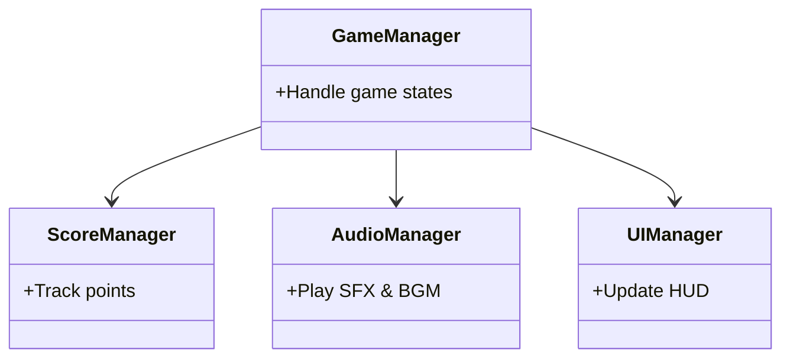
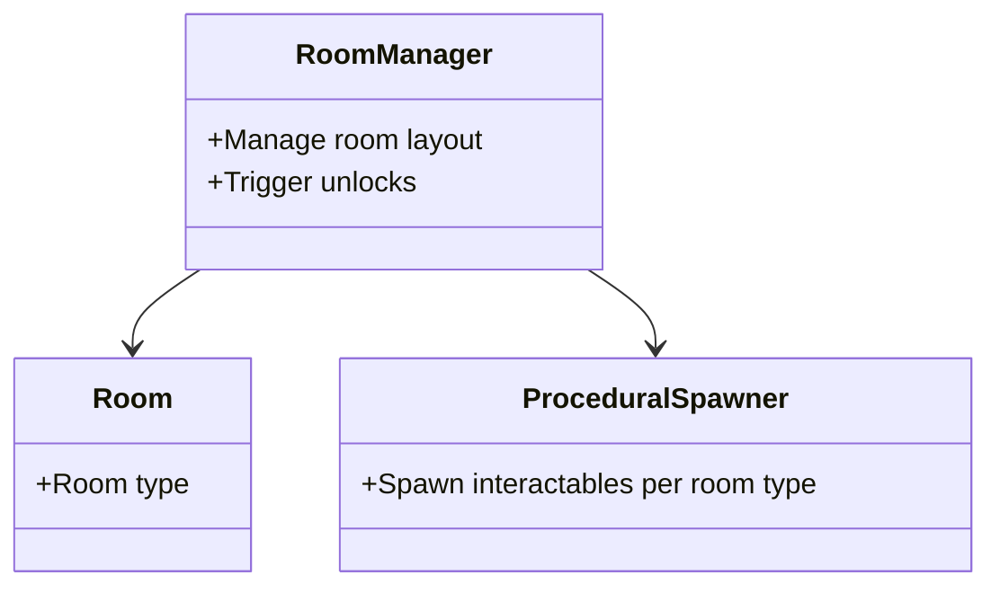
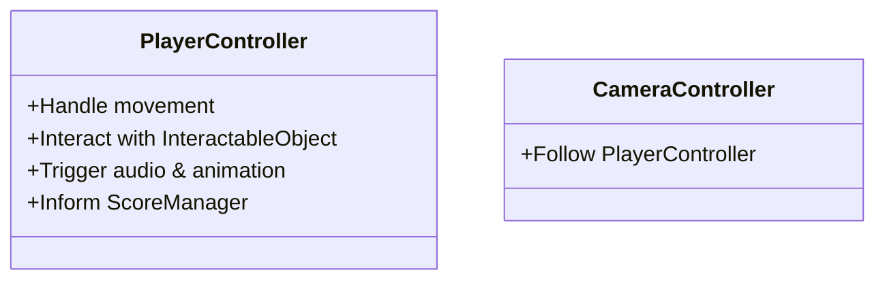
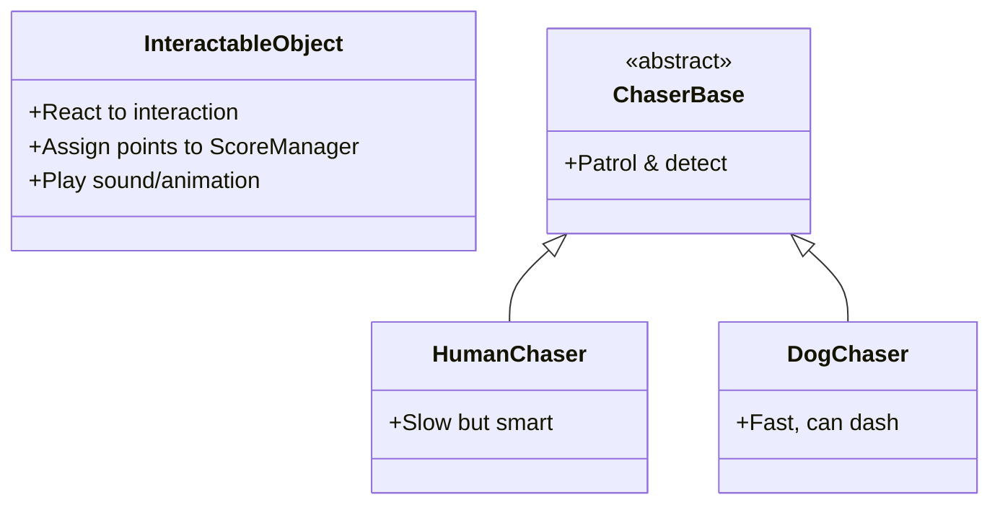

## Overview
The game is built with modular, component-based architecture in Unity. Each gameplay system (player control, interaction, AI, scoring, UI, etc.) is represented through dedicated C# classes and MonoBehaviours. Below is the class design structure focusing on relationships, not detailed implementation.

---

## Class Relationship Diagram

